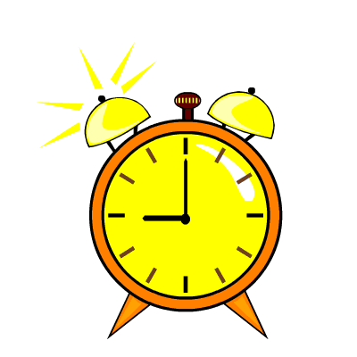
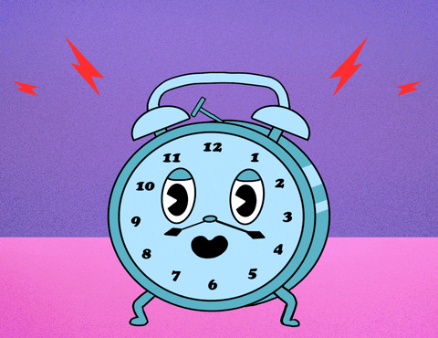

# ⏰ Temporizador & Alarma Web

Un temporizador web liviano, moderno e independiente construido exclusivamente con **HTML, CSS y JavaScript vainilla**. Diseñado para gestionar cuentas regresivas (configurado por defecto a 20 minutos) con alertas sonoras y notificaciones de escritorio.

---

## 🚀 Características

* **Sonido Sintetizado:** Utiliza la **Web Audio API** para generar una campanada melódica suave (arpegio en Do mayor) en tiempo real, sin depender de archivos `.mp3` externos.
* **Notificaciones de Escritorio:** Alerta flotante nativa del sistema operativo mediante la **Notification API** al finalizar el tiempo (funciona incluso con el navegador minimizado o en otra pestaña).
* **Controles Integrados:** Botones para **Iniciar**, **Pausar / Reanudar** y **Detener**.
* **Diseño Dark Mode:** Interfaz minimalista y responsiva adaptada para evitar el agotamiento visual.
* **Dos archivos:** Los únicos dos archivos `index.html` y `styles.css` listos para  usarlos sin necesidad de instalación o servidor.

---

## 🛠️ Tecnologías Utilizadas

* **HTML5:** Estructura semántica e inputs numéricos.
* **CSS3:** Estilos modernos con Flexbox y UI oscura.
* **JavaScript (ES6+):**
  * `setInterval` / `clearInterval` para la lógica del tiempo.
  * `Web Audio API` (`AudioContext`, `OscillatorNode`, `GainNode`) para la síntesis de audio.
  * `Notification API` para los avisos del sistema.💪🏻

---

## 💻 Instrucciones de Uso

1. Copia o descarga el código fuente en un archivo llamado `index.html`.
2. Abre `index.html` en cualquier navegador web haciendo doble clic.
3. Define los minutos deseados (o usa los **20 minutos** predeterminados) y presiona **Iniciar**.
4. Opcionalmente, acepta el permiso de notificaciones cuando el navegador lo solicite para recibir la alerta flotante.